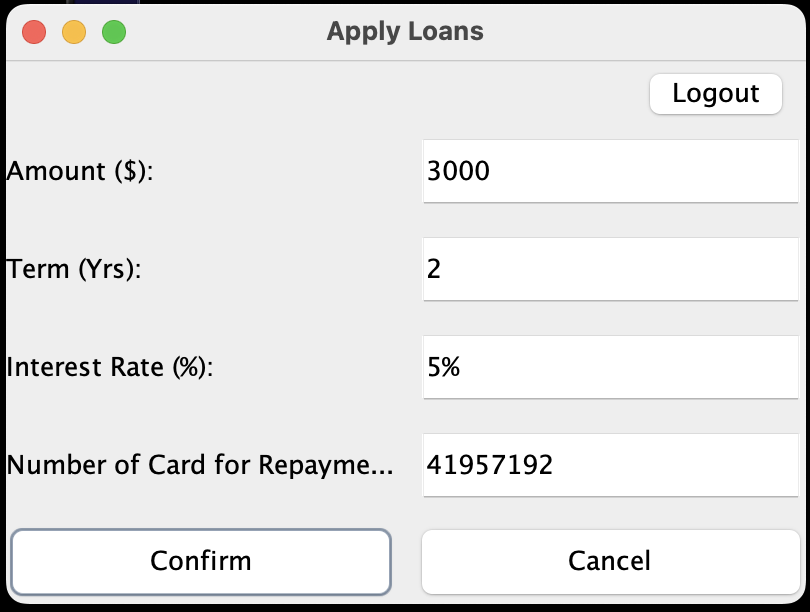
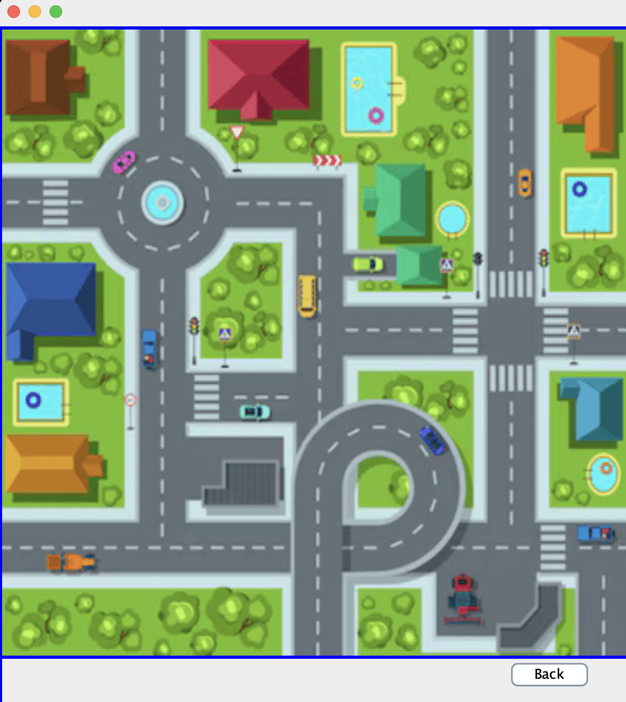
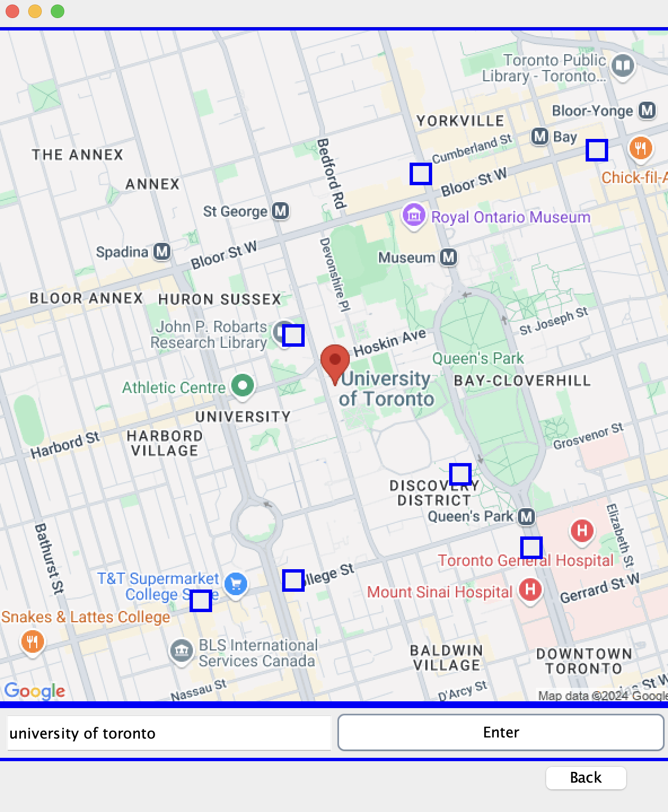

# CrazyBank Application


### A comprehensive software to access financial information and perform operations under one accessible interface.
#### Authors _(equal contribution)_: Mattea Busato, Zeyu Cai, Stefano Mauloni, Xing Xu, Yue Zheng


## Project Purpose
CrazyBank is an all-in-one financial app that combines traditional banking services like account management, 
card handling, and transactions with additional features such as asset management, currency exchange, 
real estate purchases, loans, ATM location, and insurance policy management.

It is the perfect app for anyone seeking a seamless experience with multiple services.

Conveniently accessible in one app, CrazyBank eliminates the hassle of managing multiple accounts and 
dealing with different intermediaries, which often leads to complicated processes. With complete integration
of services, everything can be done seamlessly within the app, ensuring a smoother and more efficient experience.

<a id="toc"></a>
## Table of Contents

- [Features of the Software](#fs)
- [Installation Instructions](#ii)
- [Usage Instructions](#ui)
- [License](#li)
- [Feedback](#fe)
- [Contributions](#co)
- [User Stories](#us)


<a id="fs"></a>
## Features of the Software <small><small><small><small>[↩︎ Back to TOC](#toc)</small></small></small></small>

Through the welcome view, it is possible to access every functionality of the app: 


1) **Card Manager**: The user can create new cards and name them, so to potentially divide every 
expenses in different channels.


2) **Transaction**: The user can send money without transaction fees to every other CrazyBank's customer, choosing their card of interest. 
The sender just need to know the receiver's ID.


3) **Asset Managing**: The user can acces a powerful brokerage service, in which they can search for an asset, 
check its price trend througb an interactive graph, and decide to either buy or sell it. The app does not provide
fractional share trading or short-selling capabilities, but there are no commission on each trade.


4) **Loan Maker**: It is possible to request loans. The user decide the size and duration of the loan and the app 
automatically provides an interest rate most suited to the user.



5) **Insurance Policies**: The user can request quotes for many kind of insurance policy. They get to choose the 
type and the size of the insurance, and the app provides them the optimal insurance premium for them.
[MISSING BUTTON IN CURRENT RELEASE OF THE APP]


6) **Real Estate Broker**: Included in the app there is a "House Buying Service". The user can buy a real estate asset
through the app and potentially include an insurance policy on it, for a complete seamless experience.



7) **ATM Finder**: Anywhere in the world, the user has just to type in their current position and the app provides 
them information about the nearest ATMs. 




---
<a id="ii"></a>
## Installation Instructions <small><small><small><small>[↩︎ Back to TOC](#toc)</small></small></small></small>

Follow the steps below to set up and run the project on your local machine.

### Prerequisites
Before you begin, ensure you have the following software installed:

1. **Java Development Kit (JDK)**
    - **Version**: 22 or higher
    - **Download link**: [Oracle JDK](https://www.oracle.com/java/technologies/javase-downloads.html) or [OpenJDK](https://openjdk.org/install/)

2. **Apache Maven**
    - **Version**: 3.8 or higher
    - **Download link**: [Apache Maven](https://maven.apache.org/download.cgi)

3. **Git** (for cloning the repository)
    - **Version**: Any recent version
    - **Download link**: [Git](https://git-scm.com/downloads)

4. **IDE (Optional)**
    - **Recommended**: IntelliJ IDEA
    - [JetBrains IntelliJ IDEA](https://www.jetbrains.com/idea/)

The application is meant to work on Windows and MacOS. It was not tested on Linux (any Linux feedback is appreciated).

---
### Installation Steps

1. **Clone the Repository**  
   Open a terminal and clone the repository to your local machine using Git:
   ```bash
   git clone https://github.com/DabYeet123/CSC207Project/
   cd CSC207Project
2. **Add dependencies**
   Ensure all required dependencies are downloaded by using Maven:
    ```bash
   mvn clean install
3. **Set Up Configuration Files**
    - The project relies on AlphaVantage api [AlphaVantage API](https://www.alphavantage.co/). Thus, you need to update the `api_key` property to your own key (you can get a free key easily in their website).
    - Navigate to the `src/main/resources` folder.
    - Update the `application.properties` file.
    - Example:
      ```properties
      alphavantage.api.key=your_api_key
      ```
4. **Build the Project**  
   Run the following command to compile the project:
   ```bash
   mvn compile
5. **Run the Project**  
   Start the application using the following command:
   ```bash
   mvn spring-boot:run
---

<a id="ui"></a>
## Usage Instructions <small><small><small><small>[↩︎ Back to TOC](#toc)</small></small></small></small>

The application is meant to be user-friendly. After starting the application, the user is prompted to register 
through First Name, Last Name and password. After that, the user will be associated with a unique UserID, and it
will officially be a CrazyBank's customer.


Every next time the user will be required to log in, providing userID and password. 


When logged in, it is possible to access every functionality through a simple button.


<a id="li"></a>
## License <small><small><small><small>[↩︎ Back to TOC](#toc)</small></small></small></small>

This project is licensed under the 
[CC0 1.0 Universal (Public Domain Dedication)](https://creativecommons.org/publicdomain/zero/1.0/).

You are free to use, modify, and distribute this project without any restrictions. 
For more details, please refer to the [LICENSE](./LICENSE) file in this repository.


<a id="fe"></a>
## Feedback <small><small><small><small>[↩︎ Back to TOC](#toc)</small></small></small></small>

We value your feedback and are always looking to improve this project. If you have any comments, suggestions, or issues, please follow the guidelines below:

### How to Give Feedback 
- Send your feedback via email to **stefano.mauloni@mail.utoronto.ca** [[Send mail](mailto:stefano.mauloni@mail.utoronto.ca)]
- Alternatively, you can contact either one of the authors directly through GitHub.

### Rules for Valid Feedback
- Be specific: Clearly describe the issue or suggestion.
- Provide context: If reporting a bug, include steps to reproduce it.
- Be constructive: Suggestions for improvement are highly appreciated.
- Stay respectful: Avoid using inappropriate or offensive language.

### What to Expect
- You will receive an acknowledgment of your feedback within **3 business days**.
- If applicable, we may ask follow-up questions to better understand your input.
- Bug reports and feature suggestions will be prioritized and considered for future updates.

We appreciate your contributions to making this project better!

<a id="co"></a>
## Contributions <small><small><small><small>[↩︎ Back to TOC](#toc)</small></small></small></small>
At this time, contributions to this project are **closed**.

While we appreciate your interest, we are not accepting pull requests or external contributions. 
If you have suggestions or ideas, feel free to send them as feedback via [email](mailto:stefano.mauloni@mail.utoronto.ca).

Thank you for understanding, and we hope you enjoy using the project!


<a id="us"></a>
## User Stories <small><small><small><small>[↩︎ Back to TOC](#toc)</small></small></small></small>

Stefano’s Story: Alex wants to purchase a stock. First, he wants to check the price. 
After considering the investment opportunity by looking at the data, decides to purchase 
the stock and keep it in his portfolio.

Mattea's Story: Emma wants to pay her university fees. She lunches the software, checks her balance and makes a 
transaction through the app. She can then see the transaction information on her transaction history.

Yue Zheng's Story: Jeff wants to get a new card to spend money for the trip abroad, also he wants to delete the past card
which used to spend money on paying last year loan. Also before the travel, he wants to change the money into some
other currency to make the trip easier.

Zeyu's Story: Bob can open the banking app and use it to find ATM around the city(fake). Bob wants to buy a house, he 
goes on the banking app and see a list of properties displayed on the map which he can purchase.

Xing's Story: Joe can apply for a fixed-term loan from the banking app with interests. 
Joe can buy insurance through the banking app to make sure he has all the insurance he needs covered.


